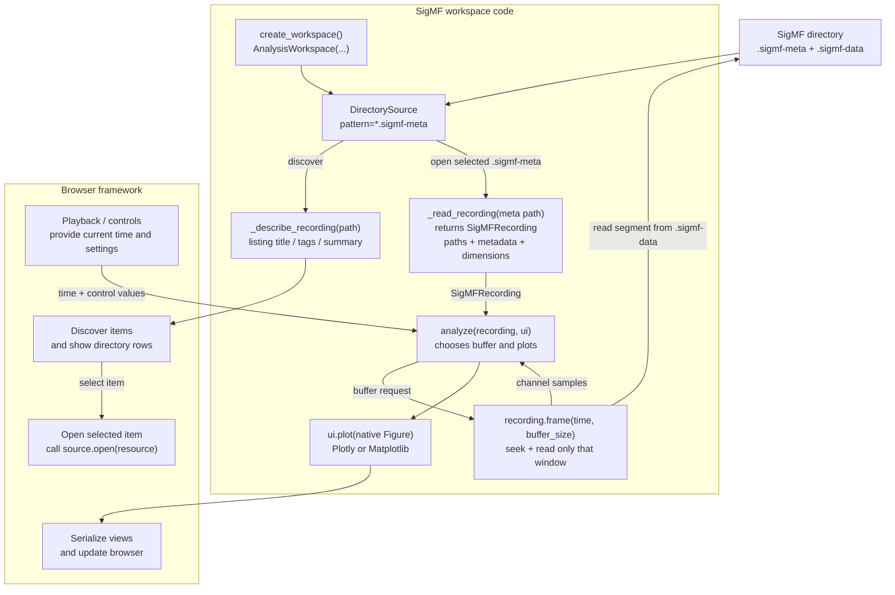

# Scientific Workspace Browser

Pure-Python framework for registering scientific workspaces, discovering viewable items, opening workspace-defined item pages, and serving a browser-oriented API.

Launching the service now opens a browser interface at `/`; the JSON API remains available for integrations.

## What is included

- Workspace contract, metadata, and item descriptors.
- Direct workspace registration and optional package entry-point discovery with failure isolation.
- Workspace catalog + item browser utilities (search, filtering, sorting, grouping, pagination).
- Declarative layout primitives (`tabs`, `row`, `column`, `grid`, `panel`, `split_pane`, `sidebar`, etc.).
- Renderable dispatch for Plotly, Matplotlib, DataFrame/table/text/image/download content types.
- Refresh manager with overlap prevention and stale-result rejection.
- Minimal HTTP service with:
  - `/health`
  - `/workspaces`
  - `/workspaces/{workspace_id}/items`
  - `/workspaces/{workspace_id}/items/{item_id}`
- Generic example workspace.
- File-backed SigMF viewers with packaged single-, two-, and four-channel `.sigmf-meta` / `.sigmf-data` playback examples: one native Plotly workspace and one native Matplotlib workspace.
- PRI analysis workspace with one responsive Plotly subplot figure containing max-hold traces above time and spectrum waterfalls.

## Writing a plugin

Most plugins should use the high-level source + analysis API instead of implementing the full workspace contract.

```python
from workspace_browser.plugin import AnalysisWorkspace, DirectorySource

def analyze(data, ui):
    window = ui.number("window", default=128, minimum=1, step=1)

    # For recorded data, the framework owns the clock and reruns this function.
    time = ui.playback(duration=data.duration, step=data.frame_duration)
    frame = data.frame(time, window)
    ui.stat("Buffer", f"{len(frame)} samples")

    with ui.tab("Overview", columns=2):
        ui.plot(make_time_figure(frame), key="time")
        ui.plot(make_spectrum_figure(frame), key="spectrum")

workspace = AnalysisWorkspace(
    identifier="my-results",
    name="My Results",
    description="Browse and inspect my result data.",
    source=DirectorySource(
        "/data/results",
        pattern="*.result",
        loader=load_my_data,
    ),
    analyze=analyze,
)
```

`DirectorySource` scans the directory and creates one browser row per matching file. Use `recursive=True` for nested directories or provide `describe(path)` to customize row titles, tags, and summary fields. Implement the `DataSource` interface when discovery is not file-based (for example, a database or REST API).

## SigMF workspace flow

The bundled SigMF workspace is the concrete example of the contract. Its loader creates a lightweight recording object; it does **not** load the `.sigmf-data` payload at item-open time. The analysis chooses a buffer, then asks that object for the current window.



`SigMFRecording` retains the metadata and file paths. `recording.frame(...)` is the workspace-defined I/O step that decides how much sample data to pull. In the PRI workspace, `buffer_seconds` determines `buffer_size`, so each playback update seeks and reads only that requested PRI-analysis buffer.

For a live source, call `ui.refresh(every=1.0)` in place of `ui.playback(...)`. The framework schedules reruns, prevents overlapping browser requests, and updates existing Plotly figures or Matplotlib image surfaces. The lower-level `Workspace` protocol remains available for unusual integrations.

Call `ui.stat(label, value)` to add workflow-specific details such as buffer size, interval count, or sample rate to the analysis panel. The framework adds analysis runtime, view callback/serialization time, and browser-side Plotly render time automatically; all values update with each processed buffer.

`ui.plot(...)` accepts either a `plotly.graph_objects.Figure` or a `matplotlib.figure.Figure` directly. Plotly keeps its interactive browser behavior; Matplotlib is encoded as a responsive PNG, so no plotting translation layer is required in the plugin.

Views can declare whether they are static item context or dynamic refresh output:

```python
with ui.tab("Calibration", update="static"):
    ui.plot(
        lambda: make_calibration_figure(data),
        key="calibration",
        depends_on=("window",),
    )

time = ui.playback(duration=data.duration, step=data.frame_duration)
with ui.tab("Playback"):  # dynamic by default
    ui.plot(make_frame_figure(data.frame(time)), key="frame")
```

Static figure factories are evaluated once per item and cached. Named `depends_on` settings create distinct cached values when those controls change. Use `ui.once(key, factory, depends_on=...)` for cached non-figure analysis shared by multiple views. During playback, the server sends only dynamic views; tabs remain mounted in the browser, so switching views does not recreate static plots or interrupt the clock.

Tabs can mix any supported renderable and use weighted columns:

```python
with ui.tab("Calibration", columns=(1, 2), update="static"):
    with ui.group("column"):
        ui.text("# Diagnostics\nReference: Channel 1", key="notes")
        ui.table(channel_offsets, key="offsets")

    with ui.group("column"):
        ui.plot(before_after_figure, key="alignment")
```

`ui.view(...)` is the generic hook; `ui.plot(...)`, `ui.text(...)`, and `ui.table(...)` are readable aliases. Groups may be rows, columns, stacks, or panels and can be nested within a tab.

Views within a tab can be switched locally without becoming analysis controls:

```python
with ui.tab("Analysis"):
    ui.view_switcher("Channel", channel_figures, key="channel", selector="buttons")
    ui.view_switcher("Metric", metric_figures, key="metric", selector="dropdown")
```

Any number of button or dropdown switchers may be combined. Each requires a unique key within the analysis.

## Launching workspace repositories

Use a browser profile to choose workspace packages and configure their data sources:

```toml
# browser.toml
[browser]
title = "Lab Browser"

[[workspaces]]
use = "radar-analysis"
path = "../radar-workspace" # optional for an installed package
id = "lab-captures"
name = "Lab captures"

[workspaces.config]
data_root = "./data/lab"

[[workspaces]]
use = "radar-analysis"
path = "../radar-workspace"
id = "field-tests"
name = "Field tests"

[workspaces.config]
data_root = "/mnt/field-tests"
```

Launch only those configured workspace instances:

```bash
workspace-browser --config browser.toml
```

Relative repository and `data_root` paths resolve from the profile directory. Each factory receives a configuration dictionary containing its `[workspaces.config]` values plus `id`, `name`, and `profile_dir`. The same factory can therefore be instantiated more than once against different data.

An independent workspace repository advertises its factory through `pyproject.toml`:

```toml
[project.entry-points."workspace_browser.workspaces"]
radar-analysis = "radar_workspace.workspace:create_workspace"
```

```python
def create_workspace(config):
    return AnalysisWorkspace(
        identifier=config["id"],
        name=config["name"],
        description="Radar analysis",
        source=DirectorySource(
            config["data_root"],
            pattern="*.sigmf-meta",
            loader=load_recording,
        ),
        analyze=analyze,
    )
```

If the package is installed, omit `path`. For an uninstalled development repository, `path` makes the launcher read that repository's entry points, add its `src` directory, and watch the repository for refresh-time hot reload. A direct `module:factory` value is also accepted in `use`. See `browser.example.toml` for a runnable profile using the bundled workspaces.

## Run

```bash
PYTHONPATH=src python -m workspace_browser.web.application --host 127.0.0.1 --port 8000
```

Workspace modules reload in-process by default:

```bash
workspace-browser
```

Leave that server running while editing workspace analysis, plotting, or layout code. Refresh the current browser page to reload changed workspace modules and rebuild the registry without restarting the process or navigating away from the current item URL. If the new module fails to load, the page shows the error and the prior registry remains intact for the next edit-and-refresh attempt.

Use `--no-reload` to disable this behavior. `--reload` remains accepted for explicit/backward-compatible development commands.

Or install and run:

```bash
pip install -e .
workspace-browser
```

## Test

```bash
PYTHONPATH=src python -m unittest discover -s tests -q
```
