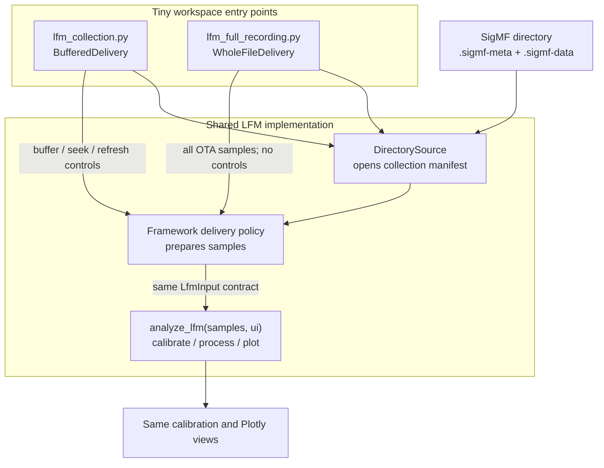

# Scientific Workspace Browser

Pure-Python framework for registering scientific workspaces, discovering viewable items, opening workspace-defined item pages, and serving a browser-oriented API.

Launching the service now opens a browser interface at `/`; the JSON API remains available for integrations.

## What is included

- Workspace contract, metadata, and item descriptors.
- Direct workspace registration and optional package entry-point discovery with failure isolation.
- Workspace catalog + item browser utilities (search, filtering, sorting, grouping, pagination).
- Declarative layout primitives (`tabs`, `row`, `column`, `grid`, `panel`, `split_pane`, `sidebar`, etc.).
- Renderable dispatch for Plotly, Matplotlib, DataFrame/table/text/image/download content types.
- Refresh manager with overlap prevention and stale-result rejection.
- Background MATLAB and all-plot PNG export jobs with window-aware filenames.
- Minimal HTTP service with:
  - `/health`
  - `/workspaces`
  - `/workspaces/{workspace_id}/items`
  - `/workspaces/{workspace_id}/items/{item_id}`
  - `/workspaces/{workspace_id}/items/{item_id}/exports?format=mat|png`
  - `/exports/{job_id}`
  - `/exports/{job_id}/{filename}`
- Generic example workspace.
- File-backed SigMF viewers with packaged single-, two-, and four-channel `.sigmf-meta` / `.sigmf-data` playback examples: one native Plotly workspace and one native Matplotlib workspace.
- PRI analysis workspace with one responsive Plotly subplot figure containing max-hold traces above time and spectrum waterfalls.

## Writing a plugin

Most plugins should use the high-level source + analysis API instead of implementing the full workspace contract.

```python
from workspace_browser.plugin import AnalysisWorkspace, DirectorySource

class PlaybackWindows:
    def prepare(self, recording, ui):
        seconds = ui.number("buffer_seconds", default=0.1, minimum=0.001)
        step = ui.number("seek_seconds", default=0.05, minimum=0.001)
        size = round(seconds * recording.sample_rate)
        time = ui.playback(mode="seek", duration=recording.duration - seconds, step=step)
        return recording.read(time=time, size=size)


def analyze(samples, ui):
    # This function only processes what it receives. It does not know whether
    # samples is a live window, a playback buffer, or a complete recording.
    with ui.tab("Overview", columns=2):
        ui.plot(make_time_figure(samples), key="time")
        ui.plot(make_spectrum_figure(samples), key="spectrum")

workspace = AnalysisWorkspace(
    identifier="my-results",
    name="My Results",
    description="Browse and inspect my result data.",
    source=DirectorySource(
        "/data/results",
        pattern="*.result",
        loader=load_my_data,
    ),
    delivery=PlaybackWindows(),
    analyze=analyze,
)
```

`DirectorySource` owns discovery and opening. The optional `DataDelivery` policy owns live refresh, playback, seeking, buffering, or whole-file loading. The analysis callback receives only the prepared data and can remain unchanged when delivery mode changes.

## SigMF workspace flow

The LFM examples show one analysis pipeline used with two delivery policies.



`BufferedDelivery` reads only the current OTA window and enables playback. `WholeFileDelivery` reads all 10,000,000 OTA samples per channel once and exposes no buffer, seek, or refresh controls. Both expose an editable processing PRF, initially 1 kHz from the collection metadata, and use it to reshape samples on every analysis run. Whole-file output reduces the complete set of resulting PRI rows to bounded waterfall display resolution. `analyze_lfm` is identical in both workspaces.

## Local LFM collection data

The 10 MHz LFM workspaces read from `./data/lfm-collection/`, which is ignored by Git and is not packaged. The manifest identifies twelve single-channel `ci16_le` IQ pairs: four calibration, four terminated-noise, and four OTA members.

```json
{
  "collection": {
    "name": "My LFM collection",
    "sample_rate": 10000000,
    "calibration_dbm": -20,
    "ota_prf_hz": 1000,
    "ota_pulse_width_seconds": 0.00005
  },
  "members": [
    {"role": "calibration", "channel": 1, "metadata": "calibration-ch1.sigmf-meta", "data": "calibration-ch1.sigmf-data", "duration_seconds": 0.1},
    {"role": "terminated-noise", "channel": 1, "metadata": "terminated-noise-ch1.sigmf-meta", "data": "terminated-noise-ch1.sigmf-data", "duration_seconds": 0.1},
    {"role": "ota", "channel": 1, "metadata": "ota-ch1.sigmf-meta", "data": "ota-ch1.sigmf-data", "duration_seconds": 1.0}
  ]
}
```

The abbreviated manifest above shows channel 1; repeat each role for channels 2 through 4. Incident calibration power is the only calibration constant. Phase, volts/count, noise power, noise PSD, and noise figure are estimated from the calibration and terminated-noise data.

Generate the synthetic local collection when you want a ready-to-run example; generated data stays ignored under `data/`:

```bash
PYTHONPATH=src python scripts/generate_lfm_collection.py
```

The generator uses spectrally white complex Gaussian noise corresponding to a hidden 7 dB true noise figure. Each calibration member is a noise-free 1 MHz tone at the declared incident power. Each terminated-noise member contains only receiver noise, and the same noise level is added independently to the OTA channels. OTA is a 1 kHz pulse train of 50 us LFM pulses sweeping 4 MHz; the analysis reads that PRF from the manifest and reshapes data at the matching 1 ms PRI. The true noise figure is intentionally not written to the collection manifest, so the calibration workflow must estimate it from the samples. To generate a different unknown case locally, pass `--noise-figure-db VALUE`.

For a live source, call `ui.refresh(every=1.0)` in place of `ui.playback(...)`. The framework schedules reruns, prevents overlapping browser requests, and updates existing Plotly figures or Matplotlib image surfaces. The lower-level `Workspace` protocol remains available for unusual integrations.

Growing recorded files can retain playback and seeking while also exposing their moving tail:

```python
time = ui.playback(
    mode="live",
    duration=current_available_duration,
    step=0.01,
    refresh_interval=0.15,
    loop=False,
)
```

Playback is an explicit pipeline policy:

| Mode | Controls | Data behavior |
| --- | --- | --- |
| `static` | No playback bar | The delivery passes the complete selected input. |
| `seek` | Play/pause, slider, and editable time | The delivery passes the window at the requested time. |
| `live` | All seek controls plus **Live** | The user can inspect history or follow the growing tail. |

The delivery selects this with `ui.playback(mode="static" | "seek" | "live", ...)`; plot and analysis functions still only receive the data prepared for them. In `live` mode, slider movement or manual time entry leaves the tail and reads the requested historical buffer; clicking **Live** resumes periodic tail following. The source or delivery policy must recalculate available duration on every analysis request. Multi-channel file readers should use the shortest current channel length so only complete common samples are exposed.

Every opened item has **Download .mat** and camera actions in the top bar. The MATLAB file contains one `workspace_export` structure with the exact data object delivered to the analysis and every registered view across all tabs and switcher choices—not only the currently visible view. Plot traces, framework tables, text/diagnostics, layout, controls, metadata, statistics, current parameters, playback, and refresh configuration are included. The camera action renders every Plotly or Matplotlib view, including hidden tab and switcher choices, as individual PNGs in one ZIP. Both exports run on a dedicated background executor so playback and other browser requests remain responsive. Seek/live workspaces export the selected buffer; static whole-file delivery exports the complete input.

Export filenames identify the item and actual delivered window, for example `capture-t0.125s-buffer0.02s-live-analysis.mat` and `capture-t0.125s-buffer0.02s-live-plots.zip`. PNG filenames repeat that context before the view name. Static delivery uses `full-static` instead of a time window.

Plugins using `AnalysisWorkspace` do not implement export handling: the framework captures the object returned by the delivery policy and all values registered through `ui.plot(...)`, `ui.table(...)`, and `ui.text(...)`. NumPy arrays, dataclasses, dictionaries, sequences, and scalar values map naturally into the MAT structure. A low-level custom `Workspace` may set `PageDefinition.export_callback` when it also wants raw delivered data included; its registered views are exported regardless. Plotly PNG generation uses Kaleido and requires a Chrome/Chromium installation discoverable by Kaleido; Matplotlib PNG generation has no browser dependency.

Call `ui.stat(label, value)` to add workflow-specific details such as buffer size, interval count, or sample rate to the analysis panel. The framework adds analysis runtime, view callback/serialization time, and browser-side Plotly render time automatically; all values update with each processed buffer.

`ui.plot(...)` accepts either a `plotly.graph_objects.Figure` or a `matplotlib.figure.Figure` directly. Plotly keeps its interactive browser behavior; Matplotlib is encoded as a responsive PNG, so no plotting translation layer is required in the plugin.

Views can declare whether they are static item context or dynamic refresh output:

```python
with ui.tab("Calibration", update="static"):
    ui.plot(
        lambda: make_calibration_figure(data),
        key="calibration",
        depends_on=("window",),
    )

time = ui.playback(mode="seek", duration=data.duration, step=data.frame_duration)
with ui.tab("Playback"):  # dynamic by default
    ui.plot(make_frame_figure(data.frame(time)), key="frame")
```

Static figure factories are evaluated once per item and cached. Named `depends_on` settings create distinct cached values when those controls change. Use `ui.once(key, factory, depends_on=...)` for cached non-figure analysis shared by multiple views. During playback, the server sends only dynamic views; tabs remain mounted in the browser, so switching views does not recreate static plots or interrupt the clock.

Tabs can mix any supported renderable and use weighted columns:

```python
with ui.tab("Calibration", columns=(1, 2), update="static"):
    with ui.group("column"):
        ui.text("# Diagnostics\nReference: Channel 1", key="notes")
        ui.table(channel_offsets, key="offsets")

    with ui.group("column"):
        ui.plot(before_after_figure, key="alignment")
```

Analysis parameters can also live directly in the tab layout. Numbers and dropdowns declared inside `ui.parameter_group(...)` are rendered in place, omitted from Details, and passed back through the same analysis callback whenever they change:

```python
with ui.tab("Noise calibration", columns=(1, 2), update="static"):
    with ui.group("column"):
        with ui.parameter_group("Noise reference", columns=2):
            reference_psd = ui.number(
                "reference_psd",
                label="Reference PSD (dBm/Hz)",
                default=data.reference_psd,
                step=0.1,
            )
            reference_lines = ui.select(
                "reference_lines",
                label="Reference lines",
                default="Expected + measured",
                options=("Expected + measured", "Expected only", "Measured only"),
            )
        ui.table(
            lambda: calibration_rows(data, reference_psd),
            key="calibration-stats",
            depends_on=("reference_psd",),
        )

    ui.plot(
        lambda: noise_figure(data, reference_psd, reference_lines),
        key="noise",
        depends_on=("reference_psd", "reference_lines"),
    )
```

Parameters can instead belong to one switched view and occupy a compact column beside its content rather than reducing plot height:

```python
with ui.tab("Calibration", update="static"):
    with ui.switcher("Calibration view", key="calibration-view"):
        with ui.switcher_view("Phase", columns=(1, 2)):
            ui.table(phase_diagnostics, key="phase-diagnostics")
            ui.plot(phase_figure, key="phase-plot")

        with ui.switcher_view("Noise", columns=(1, 2)):
            with ui.group("column"):
                with ui.parameter_group("Calibration parameters"):
                    reference_psd = ui.number("reference_psd", default=-174.0, step=0.1)
                    estimator = ui.select("estimator", default="Mean", options=("Mean", "Median"))
                ui.table(noise_diagnostics, key="noise-diagnostics")
            ui.plot(noise_figure, key="noise-plot")
```

`ui.switcher_view(...)` acts like a lightweight sub-tab and may contain mixed framework tables, text, plots, and inline parameter groups. Anything placed inside one choice is visible only for that choice. Controls declared outside `ui.parameter_group(...)` retain their existing behavior and appear in Details. For static views, list parameter names in `depends_on` so the framework maintains a separate cached result for each parameter value.

Reusable trace appearance controls can also be declared in the analysis callback. `ui.trace_style(...)` adds one compact picker to a grouped section in Details. Its color swatch and label expand to line-style, marker, native color, and width controls, while the call returns a `TraceStyle` with Plotly-ready properties:

```python
average_style = ui.trace_style(
    "average_trace",
    label="Average",
    color="#087e8b",
    width=1.5,
)
figure.add_trace(go.Scatter(
    x=x,
    y=average,
    mode=average_style.mode,
    line=average_style.line,
    marker=average_style.plotly_marker,
))
```

Workflows decide which semantic traces are configurable. Repeated channel traces can instead use a generated palette, avoiding a Details control for every channel.


`ui.view(...)` is the generic hook; `ui.plot(...)`, `ui.text(...)`, and `ui.table(...)` are readable aliases. Groups may be rows, columns, stacks, or panels and can be nested within a tab.

Views within a tab can be switched locally without becoming analysis controls:

```python
with ui.tab("Analysis"):
    ui.view_switcher("Channel", channel_figures, key="channel", selector="buttons")
    ui.view_switcher("Metric", metric_figures, key="metric", selector="dropdown")
```

Any number of button or dropdown switchers may be combined. Each requires a unique key within the analysis.

## Launching workspace repositories

Use a browser profile to choose workspace packages and configure their data sources:

```toml
# browser.toml
[browser]
title = "Lab Browser"

[[workspaces]]
use = "radar-analysis"
path = "../radar-workspace" # optional for an installed package
id = "lab-captures"
name = "Lab captures"

[workspaces.config]
data_root = "./data/lab"

[[workspaces]]
use = "radar-analysis"
path = "../radar-workspace"
id = "field-tests"
name = "Field tests"

[workspaces.config]
data_root = "/mnt/field-tests"
```

Launch only those configured workspace instances:

```bash
workspace-browser --config browser.toml
```

Relative repository and `data_root` paths resolve from the profile directory. Each factory receives a configuration dictionary containing its `[workspaces.config]` values plus `id`, `name`, and `profile_dir`. The same factory can therefore be instantiated more than once against different data.

An independent workspace repository advertises its factory through `pyproject.toml`:

```toml
[project.entry-points."workspace_browser.workspaces"]
radar-analysis = "radar_workspace.workspace:create_workspace"
```

```python
def create_workspace(config):
    return AnalysisWorkspace(
        identifier=config["id"],
        name=config["name"],
        description="Radar analysis",
        source=DirectorySource(
            config["data_root"],
            pattern="*.sigmf-meta",
            loader=load_recording,
        ),
        analyze=analyze,
    )
```

If the package is installed, omit `path`. For an uninstalled development repository, `path` makes the launcher read that repository's entry points, add its `src` directory, and watch the repository for refresh-time hot reload. A direct `module:factory` value is also accepted in `use`. See `browser.example.toml` for a runnable profile that loads the top-level `examples/` workspace package without installing it.

## Run

Install the project and its plotting/export dependencies:

```bash
python -m pip install -e .
```

Launch the repository examples with their profile:

```bash
workspace-browser --config browser.example.toml
```

For your own workspaces, copy that profile or supply another `browser.toml`. Launching without `--config` starts an empty browser to which workspaces can be registered programmatically; the framework no longer imports examples from its installed package.

The equivalent module command for the examples is:

```bash
python -m workspace_browser.web.application --host 127.0.0.1 --port 8000 --config browser.example.toml
```

Workspace modules reload in-process by default.

Leave that server running while editing workspace analysis, plotting, or layout code. Refresh the current browser page to reload changed workspace modules and rebuild the registry without restarting the process or navigating away from the current item URL. If the new module fails to load, the page shows the error and the prior registry remains intact for the next edit-and-refresh attempt.

Use `--no-reload` to disable this behavior. `--reload` remains accepted for explicit/backward-compatible development commands.

## Build a standalone executable

The included `workspace-browser.spec` creates a one-file PyInstaller executable containing Python, the framework, NumPy, SciPy, Matplotlib, Plotly, Kaleido, and their Python/native dependencies. Workspace repositories, including the top-level `examples/` directory, remain external and are selected by a browser profile. Install the build extra and run the spec from the repository root:

```bash
python -m pip install -e ".[build]"
python -m PyInstaller --clean --noconfirm workspace-browser.spec
```

The result is `dist/workspace-browser` (`dist/workspace-browser.exe` on Windows):

```bash
./dist/workspace-browser --config browser.toml
```

On Windows, launch the corresponding native build with:

```powershell
.\dist\workspace-browser.exe --config browser.toml
```

Kaleido 1.x requires Chrome or Chromium for Plotly PNG rendering. By default the spec uses Plotly's supported Chrome-for-Testing downloader, caches that platform-specific distribution under `.pyinstaller/kaleido-chrome/`, includes it in the executable, and sets `BROWSER_PATH` automatically at runtime. To produce a smaller executable that relies on Chrome already being installed on the target machine, build with:

```bash
SWB_BUNDLE_CHROME=0 python -m PyInstaller --clean --noconfirm workspace-browser.spec
```

In PowerShell, the opt-out form is `$env:SWB_BUNDLE_CHROME = "0"` followed by the same `python -m PyInstaller ...` command.

PyInstaller output is specific to the operating system and CPU architecture used for the build, so build separately on Windows, Linux, and macOS (and separately for each CPU architecture being distributed). The same spec selects and bundles the matching Chrome-for-Testing build on each platform. The executable is self-contained, but `browser.toml`, workspace repositories configured by path, and generated/local data remain external inputs. A one-file build extracts its bundled runtime and Chrome into a temporary directory when launched, so its first startup is slower than running from the Python environment.

## Test

```bash
PYTHONPATH=src python -m unittest discover -s tests -q
```
