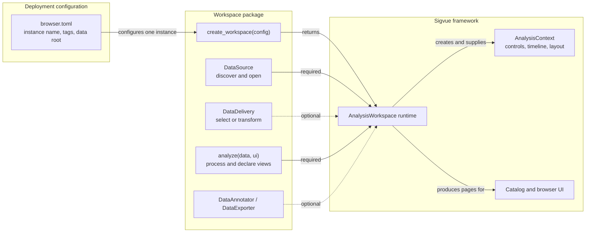
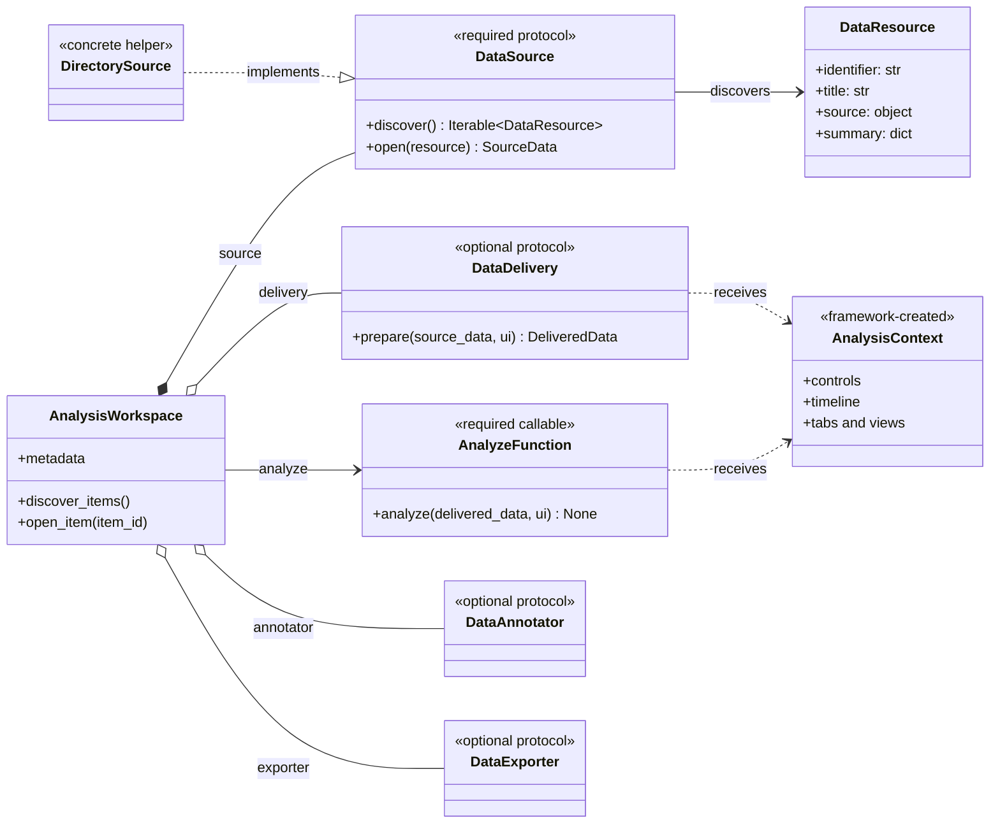
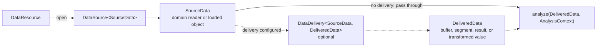
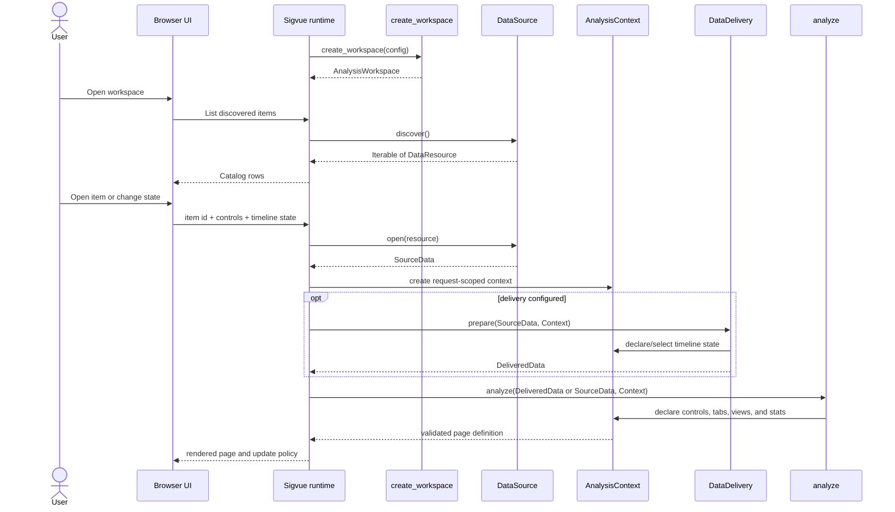
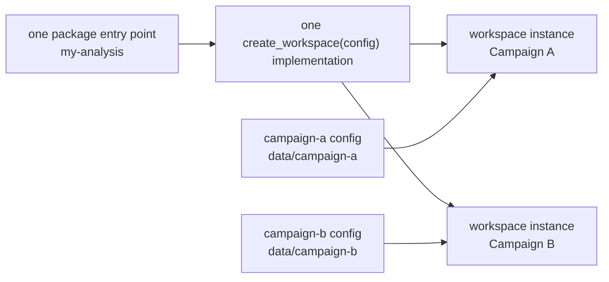
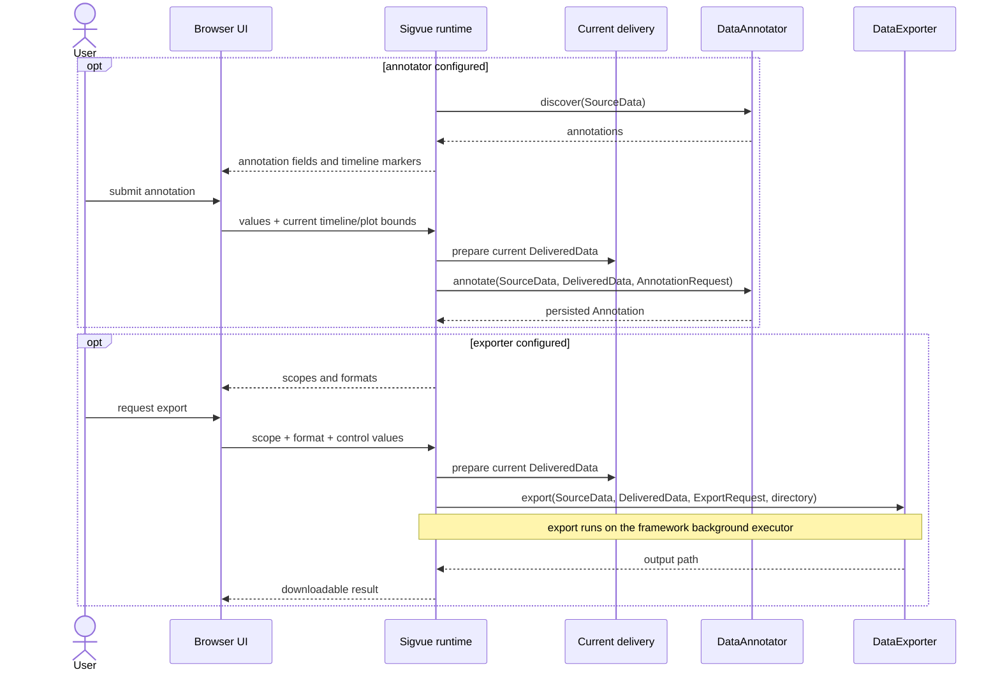

# Sigvue

Sigvue turns file-backed analysis scripts into a local browser application. A
workspace package decides:

1. Which items are available.
2. How an item is opened.
3. What data is delivered for one analysis run.
4. How that data is processed and displayed.

The framework supplies the catalog, page layout, parameters, themes, refresh
and playback controls, plot updates, background capability execution, and HTTP
service.

## Mental model

A workspace is an adapter between domain code and the Sigvue runtime. Plugin
code owns data semantics; the framework owns application lifecycle and UI
state.



The same factory may appear multiple times in `browser.toml`. Each entry creates
a separate workspace instance with its own identity, tags, and data
configuration while reusing the same source, delivery, and analysis code.

## Install and run

```bash
python -m pip install sigvue
sigvue --config browser.toml
```

Open `http://127.0.0.1:8000`. The package contains no built-in workspaces; `browser.toml` chooses which independently installed or local workspace packages to load.

## The workspace-author contract

Most workspace packages define one factory, one source, and one analysis
function. Delivery, annotation, and export are independent optional contracts.
Import public plugin types from `sigvue.plugin`; `sigvue.core` is framework
implementation detail.

### What `create_workspace()` constructs

`create_workspace(config)` must return one `AnalysisWorkspace`. These are the
values passed to its constructor:

| Constructor value | Required | Created by | Used for |
| --- | --- | --- | --- |
| `identifier`, `name`, `description` | Yes | Plugin defaults; profile may override | Standalone identity and fallback catalog metadata. |
| `source: DataSource[SourceData]` | Yes | Plugin | Discover `DataResource` records and open one domain value. |
| `analyze(data, ui)` | Yes | Plugin | Process delivered data and declare controls, views, statistics, and layout. |
| `delivery: DataDelivery[SourceData, DeliveredData]` | No | Plugin | Select a buffer, choose a segment, follow live data, or transform the opened value. |
| `annotator: DataAnnotator[...]` | No | Plugin | Discover and persist domain-native annotations. Enables **Annotate**. |
| `exporter: DataExporter[...]` | No | Plugin | Advertise formats/scopes and serialize domain data. Enables **Download**. |
| `discovery_columns` | No | Plugin | Define sortable metadata columns populated by `DataResource.summary`. |
| `version`, `category`, `tags` | No | Plugin defaults; profile may override display metadata | Catalog presentation and search. |

The factory does **not** construct `AnalysisContext`, `PageDefinition`,
`PlaybackConfiguration`, or `OpenedItem`. The framework creates those objects
for each request. A source or its `DirectorySource.describe` callback creates
`DataResource` values during discovery, not normally in the factory itself.

Public object ownership is intentionally narrow:

| Public object | Who creates it? | Where it is used |
| --- | --- | --- |
| `AnalysisWorkspace` | Plugin factory | Returned from `create_workspace()`. |
| `DataSource` implementation | Plugin factory | Passed as required `source=`. |
| `DirectorySource` | Plugin factory | Optional concrete replacement for writing a custom source. |
| `DataResource` | Source | Returned by `discover()`; later passed back to `open()`. |
| `DataDelivery` implementation | Plugin factory | Passed as optional `delivery=`. |
| `DiscoveryColumn` | Plugin factory | Passed in optional `discovery_columns=`. |
| `DataAnnotator` / `DataExporter` | Plugin factory | Passed as optional capability objects. |
| `AnnotationField`, `CapabilityChoice` | Plugin capability | Advertise framework-rendered capability inputs. |
| `AnnotationRequest`, `ExportRequest` | Framework | Passed into plugin capability methods. |
| `AnalysisContext` | Framework | Passed into delivery and analysis for the current request. |
| `Segment` | Plugin delivery or analysis | Passed into `ui.segmented(...)`. |
| `TraceStyle` | Framework | Returned by `ui.trace_style(...)` for plotting code. |

A fully populated factory has this shape; every line marked optional may simply
be omitted:

```python
def create_workspace(config):
    return AnalysisWorkspace(
        identifier="my-analysis",                 # required fallback metadata
        name="My Analysis",                       # required fallback metadata
        description="Inspect domain recordings.", # required fallback metadata
        source=MySource(config["data_root"]),      # required DataSource
        analyze=analyze,                           # required callable
        delivery=MyDelivery(),                     # optional DataDelivery
        annotator=MyAnnotator(),                   # optional capability
        exporter=MyExporter(),                     # optional capability
        discovery_columns=MY_COLUMNS,              # optional catalog schema
        category="signal analysis",               # optional fallback metadata
        tags=("windowed", "domain-format"),        # optional fallback metadata
    )
```

### Contract relationships



### Typed data path

`DataSource` and `DataDelivery` are public, generic, runtime-checkable
interfaces. Their type parameters describe the complete data path:



`AnalysisWorkspace` has typed constructor overloads connecting these stages. A
type checker therefore catches a delivery that expects the wrong reader type or
an analysis function that expects something other than the delivery output.
The installed package includes a `py.typed` marker, so these checks also work
when `sigvue` is installed from a wheel.

Implementations should explicitly inherit the interfaces when practical; this
makes the contract visible and lets type checkers verify the whole path:

```python
from collections.abc import Iterable

from sigvue.plugin import AnalysisContext, DataDelivery, DataResource, DataSource


class MySource(DataSource[Recording]):
    def discover(self) -> Iterable[DataResource]:
        ...

    def open(self, resource: DataResource) -> Recording:
        ...


class WindowDelivery(DataDelivery[Recording, SampleWindow]):
    def prepare(
        self,
        recording: Recording,
        ui: AnalysisContext,
    ) -> SampleWindow:
        ...
```

Explicitly inherited methods are abstract, so an incomplete subclass cannot be
instantiated. Inheritance is not required: structurally compatible objects also
satisfy the interfaces. At runtime, `AnalysisWorkspace` validates that sources
provide `discover()` and `open()`, deliveries provide `prepare()`, analysis is
callable, discovery returns `DataResource` objects, and resource identifiers
are unique. Failures identify the missing method or invalid discovery value
directly.

### Request lifecycle

The factory runs when the profile is loaded or reloaded. Source I/O, delivery,
and analysis run later, when the browser discovers or opens data.



`source.open()` is called for the selected item on each page request. A domain
reader may therefore be lightweight and read only the requested interval when
delivery calls it. `ui.once(...)` is available for item-level work that should
survive dynamic requests.

### Minimal file-backed workspace

```python
# src/my_workspace/workspace.py
import json
from collections.abc import Mapping
from pathlib import Path
from typing import TypedDict

import plotly.graph_objects as go

from sigvue.plugin import AnalysisContext, AnalysisWorkspace, DirectorySource


class ResultFile(TypedDict):
    values: list[float]


def load_result(path: Path) -> ResultFile:
    return json.loads(path.read_text())


def analyze(result: ResultFile, ui: AnalysisContext) -> None:
    scale = ui.number("scale", label="Scale", default=1.0, step=0.1)
    values = [scale * value for value in result["values"]]

    figure = go.Figure(go.Scatter(y=values, name="Value"))
    with ui.tab("Values"):
        ui.plot(figure, key="values")


def create_workspace(config: Mapping[str, object]) -> AnalysisWorkspace:
    source = DirectorySource[ResultFile](
        Path(str(config["data_root"])),
        pattern="*.result.json",
        loader=load_result,
    )
    return AnalysisWorkspace(
        # Required fallback metadata; browser.toml may override it per instance.
        identifier="result-analysis",
        name="Result Analysis",
        description="Inspect result files.",
        # Required contracts.
        source=source,
        analyze=analyze,
    )
```

That is the complete minimal contract: one `DirectorySource` and one analysis
callable assembled into `AnalysisWorkspace`. Add delivery or capabilities only
when the workflow needs them.

Set `recursive=True` on `DirectorySource` to preserve nested directories in the
browser. The framework derives folder breadcrumbs from each file's path relative
to the source root; files are not flattened and directories are not presented as
fake analysis items. A custom source can provide the same behavior by setting
`DataResource(navigation_path=("campaign", "day-2"), ...)`.

### Discovery columns

Each workspace can declare the metadata columns shown beside discovered files.
The workspace supplies raw values in `DataResource.summary`; Sigvue owns table
rendering, null display, search, and sorting:

```python
from pathlib import Path

from sigvue.plugin import AnalysisWorkspace, DataResource, DiscoveryColumn

columns = (
    DiscoveryColumn("date", "Date", kind="datetime"),
    DiscoveryColumn("sample_rate", "Sampling rate", kind="si", unit="sample/s"),
    DiscoveryColumn("rf_frequency", "RF frequency", kind="si", unit="Hz"),
)

resource = DataResource(
    identifier="recording-1",
    title="Recording 1",
    source=Path("recording-1.sigmf-meta"),
    summary={
        "date": "2026-07-19T12:00:00Z",
        "sample_rate": 10_000_000,
        "rf_frequency": None,
    },
)

workspace = AnalysisWorkspace(
    # ...normal workspace arguments...
    discovery_columns=columns,
)
```

Column kinds are `text`, `number`, `datetime`, and `si`. Missing values remain
visible as unavailable values and sort after populated values in either sort
direction. Browser search includes titles, paths, tags, and every declared
summary value.

Advertise the factory in the workspace package:

```toml
# pyproject.toml in the workspace package
[project.entry-points."sigvue.workspaces"]
my-analysis = "my_workspace.workspace:create_workspace"
```

Select and configure it:

```toml
# browser.toml
[browser]
title = "My Analysis Browser"
subtitle = "Explore scientific and analytical results"

[[workspaces]]
use = "my-analysis"
id = "results"
name = "Results"
description = "Inspect the current campaign results"
category = "laboratory"
tags = ["campaign", "review"]

[workspaces.config]
data_root = "./data"
```

Top-level `id`, `name`, `description`, `category`, `tags`, and `icon` belong to
that displayed workspace instance and override the factory's default metadata.
This lets multiple entries use the same factory while appearing as distinct
workspaces. The factory receives `[workspaces.config]` for data and analysis
behavior. For compatibility, `id` and `name` are also present in `config`;
`profile_dir` is always supplied. Relative paths resolve from the directory
containing `browser.toml`.

```toml
[[workspaces]]
use = "my-analysis"
id = "campaign-a"
name = "Campaign A"
tags = ["field", "2026"]
[workspaces.config]
data_root = "./data/campaign-a"

[[workspaces]]
use = "my-analysis"
id = "campaign-b"
name = "Campaign B"
tags = ["laboratory", "reference"]
[workspaces.config]
data_root = "./data/campaign-b"
```



These are two registered workspace instances, not two plugin implementations.
Their framework routes and catalog identities are isolated by their unique
top-level `id` values.

For an uninstalled workspace under development, add its repository path:

```toml
[[workspaces]]
use = "my-analysis"
path = "../my-workspace"
id = "results"
name = "Results"
```

The browser adds its `src` directory. Reloading the browser page reparses
`browser.toml` and applies added, removed, or reconfigured workspace entries
without restarting the server. Changed workspace modules are reloaded as part
of the same request; use `--no-reload` to disable subsequent automatic module
watching. A direct `module:factory` string is also accepted in `use`.

## Data delivery

Without a delivery object, `analyze` receives exactly what the source opened. A delivery object can prepare a different value while leaving analysis unchanged:

```python
from dataclasses import dataclass

from sigvue.plugin import AnalysisContext, DataDelivery


@dataclass(frozen=True)
class SampleWindow:
    start_seconds: float
    samples: list[complex]


class FrameDelivery(DataDelivery[Recording, SampleWindow]):
    def prepare(
        self,
        recording: Recording,
        ui: AnalysisContext,
    ) -> SampleWindow:
        frame_seconds = ui.number("frame_seconds", default=0.1, minimum=0.001)
        position = ui.playback(
            mode="seek",
            duration=max(0.0, recording.duration - frame_seconds),
            step=0.01,
        )
        return SampleWindow(position, recording.read(position, frame_seconds))


def analyze(window: SampleWindow, ui: AnalysisContext) -> None:
    ...
```

Pass it to `AnalysisWorkspace(delivery=FrameDelivery(), ...)`. The framework calls `source.open`, then `delivery.prepare`, then `analyze` for every requested state.

Available lifecycle modes are:

| Mode | Framework UI | Delivery behavior |
| --- | --- | --- |
| `static` | No timeline | Return the complete or fixed input. |
| `seek` | Play/pause, slider, editable time | Return the buffer at the requested time. |
| `live` | Seek controls plus **Live** | Return historical buffers or follow a growing source. |
| `windowed` | Movable and resizable interval, optionally over a full-record overview | Return only the selected interval. |
| `segmented` | Discrete markers with previous/next navigation | Return the selected regular or irregular segment. |

Use `ui.playback(...)` for static, seek, and live policies. In live mode, the delivery should check the currently available duration on each request.

Timeline values remain canonical seconds between the browser, delivery, annotations,
and exports, but a pipeline can choose the unit used by every framework-owned display:

```python
position = ui.playback(
    mode="seek",
    duration=3 * 86_400,
    step=60,
    time_unit="h",
)
```

Pass `time_unit=` to `ui.playback`, `ui.windowed`, or `ui.segmented`. Supported
physical-time values are `"ns"`, `"us"`, `"ms"`, `"s"`, `"min"`, `"h"`, and
`"d"`; `"auto"` chooses a sensible unit from the full duration. Editable boxes
display and accept that unit while delivery continues receiving canonical
seconds, so changing presentation units cannot change sample addressing or
persisted annotation times. `time_unit="samples"` is an explicit normalized
coordinate mode for data without a known sample rate; in that mode the pipeline
supplies and consumes sample coordinates instead of physical seconds.

For windowed selection, the workspace reads the returned interval and may provide a low-resolution overview statistic:

```python
start, end = ui.windowed(
    duration=recording.duration,
    default_window=0.1,
    minimum_window=0.001,
    step=0.001,
    overview=recording.summary_values(),
    overview_label="Activity",
    time_unit="ms",
)
return recording.read(start, end)
```

`overview` is optional. When supplied, it may be any finite 1D summary and does not need one value per sample. The framework distributes its values uniformly over the recording duration, so block statistics, sliding-window results, and decimated summaries all work. The framework draws and operates the range selector; tabs and exports receive only the value returned by the delivery policy.

For irregular stored results, provide explicit segment descriptors and use the returned descriptor to load the matching result:

```python
from sigvue.plugin import Segment

selected = ui.segmented(
    duration=recording.duration,
    segments=(
        Segment("event-1", 1.25, 0.08, "First event"),
        Segment("event-2", 4.90, 0.12, "Second event"),
    ),
)
return results_by_id[selected.identifier]
```

Regular segments with gaps or overlaps can instead use `ui.segmented(duration=..., segment_duration=..., stride=...)`. Segmented mode only owns selection and navigation; the delivery policy decides whether selecting a marker reads raw data, computes one interval lazily, or loads an existing post-processing result.

For non-playback refresh, call `ui.refresh(every=1.0)`. The framework prevents overlapping refresh requests and updates mounted views.

## Analysis UI

The commonly used `AnalysisContext` methods are:

| Method | Purpose |
| --- | --- |
| `ui.tab(label, columns=..., update=...)` | Add a tab and choose its layout and static/dynamic lifecycle. |
| `ui.plot(figure, key=...)` | Display a native Plotly or Matplotlib figure. |
| `ui.table(value, key=...)` | Display tabular data. |
| `ui.text(value, key=...)` | Display text or Markdown diagnostics. |
| `ui.number(...)`, `ui.select(...)`, `ui.color(...)` | Declare stored user parameters. |
| `ui.colormap(...)` | Add a compact Plotly colormap picker with low-to-high gradient previews. |
| `ui.limits(...)` | Add validated paired numeric bounds. |
| `ui.parameter_group(...)` | Place parameters directly inside the current view. |
| `ui.view_switcher(...)` | Switch local views with buttons or a dropdown without creating another tab. |
| `ui.trace_style(...)` | Add a compact color, width, opacity, line-style, and marker picker. |
| `ui.stat(label, value)` | Add workflow-specific runtime or result details. |
| `ui.once(key, factory, depends_on=...)` | Cache item-level work across dynamic updates. |
| `ui.segmented(...)` | Select one regular or irregular timeline segment. |

Plotly figures remain interactive. Matplotlib figures are rendered as responsive PNG images. Tabs can mix plots, tables, and text.

Use `update="static"` for item context that should be computed once and `update="dynamic"` for data that follows delivery. A static plot factory can name parameter dependencies:

```python
with ui.tab("Reference", update="static"):
    ui.plot(
        lambda: make_reference_figure(data, threshold),
        key="reference",
        depends_on=("threshold",),
    )
```

## Optional annotation and export capabilities

Annotation and download are plugin-owned capabilities. If a workspace does not pass an
`annotator=` or `exporter=` to `AnalysisWorkspace`, the corresponding header menu is not
shown. The framework supplies typed field/choice helpers, renders the controls, and runs
exports on its background executor; the plugin decides how annotations are persisted and
how its domain data is serialized.



Implement `DataAnnotator` to discover timeline annotations and add one from the current
delivered value. Implement `DataExporter` to advertise scope and format choices and write
one result file into the supplied directory. `CapabilityChoice`, `AnnotationField`,
`AnnotationPlotBinding`, `Annotation`, `AnnotationRequest`, and `ExportRequest` are
available from `sigvue.plugin`.
This keeps formats such as SigMF annotations, MAT, JSON, or a domain-specific archive out
of the framework.

Plot-oriented plugins can attach an `AnnotationPlotBinding` to a numeric
`AnnotationField`. When the annotation menu opens, Sigvue fills that input from the
currently visible lower or upper edge of the named axis. A pipeline can set
`selection_policy="box_preferred"` on the binding to prefer the latest compatible Plotly
box-selection bounds; deselecting or double-clicking clears the captured box. The plugin
declares the unit transform and may add the current playback position for buffer-relative
plot axes; the resulting editable value is still persisted entirely by the plugin.

## HTTP API

The browser UI uses the same local JSON API available to integrations:

| Method and path | Result |
| --- | --- |
| `GET /health` | Service health. |
| `GET /workspaces` | Registered workspaces. |
| `GET /workspaces/{workspace_id}/items` | Discovered items. |
| `GET /workspaces/{workspace_id}/items/{item_id}` | Page definition and rendered views. Query parameters carry controls and timeline state. |
| `POST /workspaces/{workspace_id}/items/{item_id}/exports` | Start a plugin-owned background export with `scope`, `format`, and `control_values`. |
| `GET /exports/{job_id}` | Poll export status. |
| `GET /exports/{job_id}/{filename}` | Download a completed export. |
| `POST /workspaces/{workspace_id}/items/{item_id}/annotations` | Add an annotation through the plugin contract. |

## PyPI and standalone distribution

The PyPI wheel contains:

- The browser server and typed plugin contracts.
- Dependency metadata that installs Plotly and Matplotlib.
- The PyInstaller spec under `sigvue._packaging`.
- The `sigvue-build` command.

To build a platform-specific, one-file executable:

```bash
python -m pip install "sigvue[build]"
sigvue-build
```

The result is `dist/sigvue` or `dist/sigvue.exe`. Build separately on Windows, Linux, and macOS.

Workspace packages, `browser.toml`, and data remain external to the executable.

## Development

```bash
python -m pip install -e ".[build]"
PYTHONPATH=src python -m unittest discover -s tests -q
```

Neutral, runnable workspace packages are maintained separately so the framework distribution stays format-independent: [Sigvue Examples](https://github.com/briday1/sigvue-examples).
