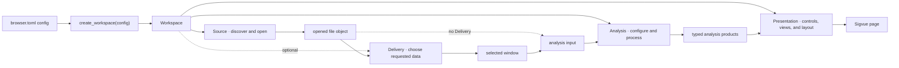

# Example pipelines

This directory is deliberately outside `src/sigvue`: it is plugin code, not framework code. The waterfall example is arranged so the whole directory can be copied into another repository.

```text
example_pipelines/
├── io/sigmf/          shared file-format I/O
├── style/             shared teal/orange Plotly appearance
├── comms/             windowed constellation and eye-diagram pipeline
├── waterfall/
│   ├── source.py       discovery and loader binding
│   ├── delivery.py     window-selection and ranged reads
│   ├── analysis.py     numerical processing
│   ├── plots.py        controls, Plotly figure, and tab layout
│   └── workspace.py    framework object assembly only
├── scripts/
│   ├── generate_all.py
│   ├── generate_comms.py
│   └── generate_lte.py
└── browser.toml
```

Generate the synthetic LTE uplink/downlink and QPSK/16-QAM/64-QAM SigMF recordings, then launch Sigvue:

```bash
python example_pipelines/scripts/generate_all.py
sigvue --config example_pipelines/browser.toml
```

Open <http://127.0.0.1:8000>. Generated data stays untracked. The LTE
uplink and downlink pairs are written together under `example_pipelines/data/lte/`;
the modulation recordings are written under `example_pipelines/data/comms/`.
Pass `--output PATH` to place both dataset groups under another data root. The
individual `generate_lte.py` and `generate_comms.py` scripts remain available
when only one group is needed.

## The current plugin contract

`create_workspace()` assembles framework-defined objects; it does not perform
the analysis itself. `Source`, `Analysis`, and `Presentation` are required.
`Delivery` is optional: omit it for a complete-file analysis, or provide it when
the framework should expose seek, live, windowed, or segmented data selection.



Each pipeline therefore reads like a small processing program:

```python
return Workspace(
    source=recording_source(root),
    delivery=WindowedSamples(),       # optional
    analysis=WaterfallAnalysis(),     # process selected data
    presentation=WaterfallPresentation(),  # display products
    lazy_views=True,                  # create only the selected layout branch
    identifier="synthetic-lte-waterfall",
    name="Synthetic LTE Waterfall",
)
```

The framework creates and passes `DeliveryContext`, `ParameterContext`, and
`ViewContext`. Plugin authors use those contexts to declare behavior and UI;
they do not construct or return framework page internals.

Both reference workspaces opt into `lazy_views=True`, so changing tabs or a view
switcher requests only the newly visible figures. Omit it (or set it to `False`)
when all views should be created during the first request and later view changes
must remain client-local.

## What the waterfall example demonstrates

The workspace assembly contains only framework contract objects. Each object owns one
kind of behavior and declares controls only through the request-scoped API it
receives:

| Module object | Framework contract | Demonstrated API |
| --- | --- | --- |
| `recording_source(root)` | Returns `DirectorySource` | File discovery, nested paths, SigMF opening, and catalog summaries. |
| `WindowedSamples()` | `Delivery` | `DeliveryContext.windowed()` with a decimated full-record power overview. |
| `WaterfallAnalysis()` | `Analysis` | `ParameterContext.select()` for FFT size and overlap, followed by ordinary NumPy processing. |
| `WaterfallPresentation()` | `Presentation` | Tabs, Plotly rendering, colormap, paired limits, toggle, trace-style picker, statistics, theme, and bounded axes through `ViewContext`. |

The communications example stays compact while adding `WindowedCommsDelivery`
for a draggable received-power overview. `CommsAnalysis` processes only that
selected interval, and `CommsPresentation` provides constellation and eye tabs.
It still omits processing parameters, annotations, and export behavior.

## Test

From the repository root:

```bash
python -m pytest -q example_pipelines/tests
```

These tests live with the pipelines and are run as an explicit step in the
repository's publish workflow.
