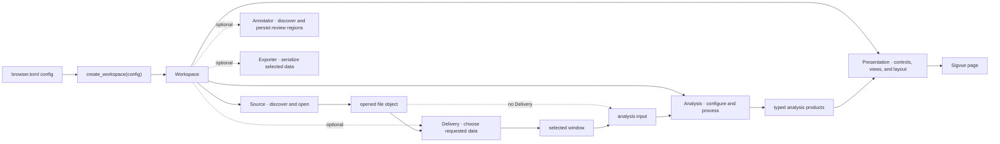

# Example pipelines

This directory is deliberately outside `src/sigvue`: it contains
pipeline-specific processing and presentation code plus a copyable plugin
toolkit. Plugin-aware building blocks live in `example_pipelines.plugins`;
framework-level utilities such as path configuration and byte formatting remain
in `sigvue.helpers`. A new pipeline can therefore compose a source, windowing,
annotation, export, lifecycle, and SigMF-writing stack without rebuilding
one-method classes or file-format plumbing.

This is the small, source-copyable version of the helper layer. The standalone
examples distribution exposes the same public surface under
`sigvue_examples.plugins` for its richer set of workspaces. Neither version is
part of the `sigvue` framework package.

```text
example_pipelines/
├── plugins/           copyable concrete plugin helpers
│   ├── discovery.py    common signal catalog columns
│   ├── lifecycle.py    function-to-plugin lifecycle adapters
│   ├── plotly.py       exact annotation-region overlays
│   └── sigmf/          source, reader, delivery, annotation, export, writer
├── style/             shared teal/orange Plotly appearance
├── comms/             windowed constellation and eye-diagram pipeline
├── waterfall/
│   ├── analysis.py     numerical processing
│   ├── plots.py        pure Plotly figure construction
│   ├── presentation.py controls and workspace layout
│   └── workspace.py    framework object assembly only
├── scripts/
│   ├── generate_all.py
│   ├── generate_comms.py
│   └── generate_lte.py
└── browser.toml
```

Generate the synthetic LTE uplink/downlink and QPSK/16-QAM/64-QAM SigMF recordings, then launch Sigvue:

```bash
python -m pip install -e ".[examples]"
python -m example_pipelines.scripts.generate_all
sigvue --config example_pipelines/browser.toml
```

Open <http://127.0.0.1:8000>. Generated data stays untracked. The LTE
uplink and downlink pairs are written together under `example_pipelines/data/lte/`;
the modulation recordings are written under `example_pipelines/data/comms/`.
Pass `--output PATH` to place both dataset groups under another data root. The
individual generators remain available as
`python -m example_pipelines.scripts.generate_lte` and
`python -m example_pipelines.scripts.generate_comms` when only one group is
needed. Both delegate the file-format details to `write_sigmf_recording()`.

## The current plugin contract

`create_workspace()` assembles framework-defined objects; it does not perform
the analysis itself. `Source`, `Analysis`, and `Presentation` are required.
`Delivery` is optional: omit it for a complete-file analysis, or provide it when
the framework should expose seek, live, windowed, or segmented data selection.



Each pipeline therefore reads like a small processing program:

```python
from example_pipelines.plugins import CallableAnalysis, CallablePresentation
from example_pipelines.plugins.sigmf import (
    SigMFExporter,
    WaterfallSigMFAnnotator,
    WindowedSigMFDelivery,
    sigmf_source,
)

return Workspace(
    source=sigmf_source(root, tags=("sigmf", "synthetic")),
    annotator=WaterfallSigMFAnnotator(
        "lte-waterfall",
        "annotation_region_color",
    ),
    exporter=SigMFExporter(),
    delivery=WindowedSigMFDelivery(
        default_window=0.012,
        minimum_window=0.004,
        step=0.002,
        time_unit="ms",
    ),
    analysis=CallableAnalysis(process, configure),
    presentation=CallablePresentation(present),
    lazy_views=True,
    identifier="synthetic-lte-waterfall",
    name="Synthetic LTE Waterfall",
)
```

The framework creates and passes `DeliveryContext`, `ParameterContext`, and
`ViewContext`. Plugin authors use those contexts to declare behavior and UI;
they do not construct or return framework page internals.

Both reference workspaces opt into `lazy_views=True`, so changing tabs or a view
switcher requests only the newly visible figures. Omit it (or set it to `False`)
when all views should be created during the first request and later view changes
must remain client-local.

## Reusable helpers versus pipeline code

The workspace assembly imports concrete plugin behavior from the local toolkit
instead of rebuilding it in each pipeline:

| Reusable helper | Responsibility | Location |
| --- | --- | --- |
| `configured_path()` | Resolve optional workspace paths consistently. | `sigvue.helpers` |
| `sigmf_source()` | Discover nested recordings, build catalog summaries, and return validated, ranged, channel-first readers. | `example_pipelines.plugins.sigmf` |
| `WindowedSigMFDelivery` | Add draggable window selection, cached power overviews, and ranged reads. | `example_pipelines.plugins.sigmf` |
| `SIGMF_DISCOVERY_COLUMNS` | Reuse the standard date, sample-rate, and RF-frequency catalog columns. | `example_pipelines.plugins.sigmf` |
| `SigMFAnnotator` and `WaterfallSigMFAnnotator` | Persist time or time-frequency review regions as standard SigMF annotations. | `example_pipelines.plugins.sigmf` |
| `add_time_frequency_annotation_regions()` | Draw exact, hoverable vector regions independently of heatmap rasterization. | `example_pipelines.plugins` |
| `SigMFExporter` | Export the current buffer or full recording as JSON or MAT. | `example_pipelines.plugins.sigmf` |
| `CallableAnalysis` and `CallablePresentation` | Adapt ordinary functions to lifecycle contracts without one-method wrapper classes. | `example_pipelines.plugins` |
| `format_bytes()` | Format resident buffer sizes consistently. | `sigvue.helpers` |
| `write_sigmf_recording()` | Write sample data and standards-shaped metadata from generators and fixtures. | `example_pipelines.plugins.sigmf` |

The local package depends on public plugin contracts and its scientific-format
libraries, so it can be copied into another examples or application repository
as one unit. The pipeline directories then contain only domain analysis,
plotting, presentation, and workspace composition.

Only domain behavior remains local. The waterfall functions configure FFT
parameters, calculate spectral products, and build spectrum/waterfall views.
The communications functions recover symbols and build constellation and eye
views. Both analyses explicitly select channel 0 from `SigMFWindow`; a
multichannel pipeline can select or combine channels without changing the
shared reader. The waterfall presentation also renders persisted annotation
regions with hover details and shared display controls.

## Test

From the repository root:

```bash
python -m pytest -q example_pipelines/tests
```

These tests live with the pipelines and are run as an explicit step in the
repository's publish workflow.
